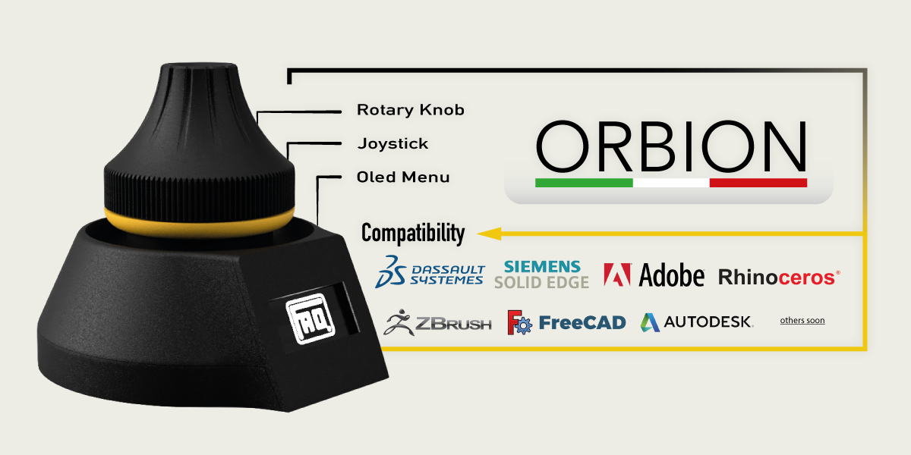
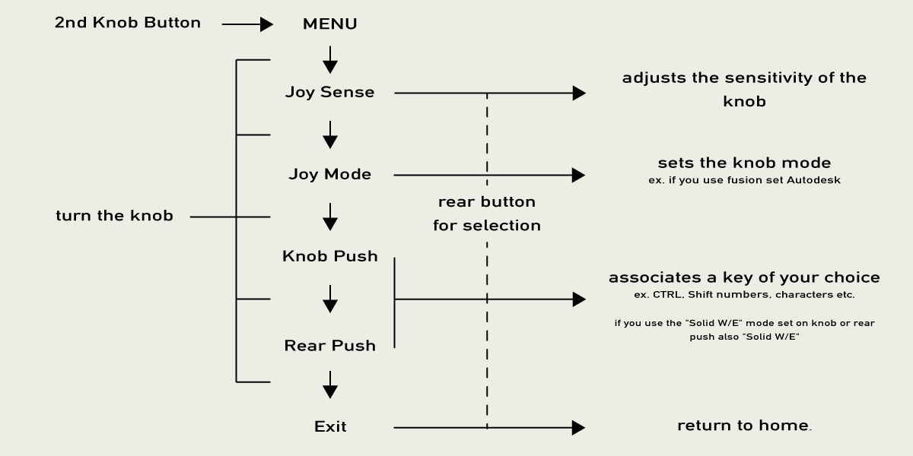
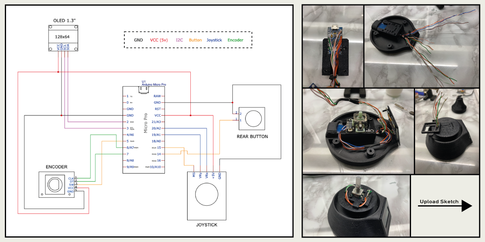

# Orbion The OpenSource Space Mouse

To ensure greater precision and fluidity it is recommended to put a foam ring under the knob (see photo above) and dielectric lubricant in the joystick!

follow me for other news :P
https://www.instagram.com/faq_t0tum/

The ORBION project is OpenSource so if you have the pleasure of supporting my next works I will be grateful fot the coffee.  
PayPal: https://www.paypal.me/MattiaRusso308?locale.x=it_IT

Componets:
- M3x20 (7pcs)
- Nuts M3 (3pcs)
- Oled 1.3" I2C: 
https://s.click.aliexpress.com/e/_AtYDV6
- Encoder (KY-040): 
https://s.click.aliexpress.com/e/_AmjV9a
- Joystick (KY-023): 
https://s.click.aliexpress.com/e/_AM43rq2 (important: the joystick shaft must be 4mm)
- Arduino Pro Micro:
https://s.click.aliexpress.com/e/_AYt9zi
- Push Button 8mm:
https://s.click.aliexpress.com/e/_ADGxZS
- Foam

video: https://youtube.com/embed/NqHIdklkzfw

For Onshape:
By default right mouse button is pressed, so it is recommend to add scroll for example on knob button.