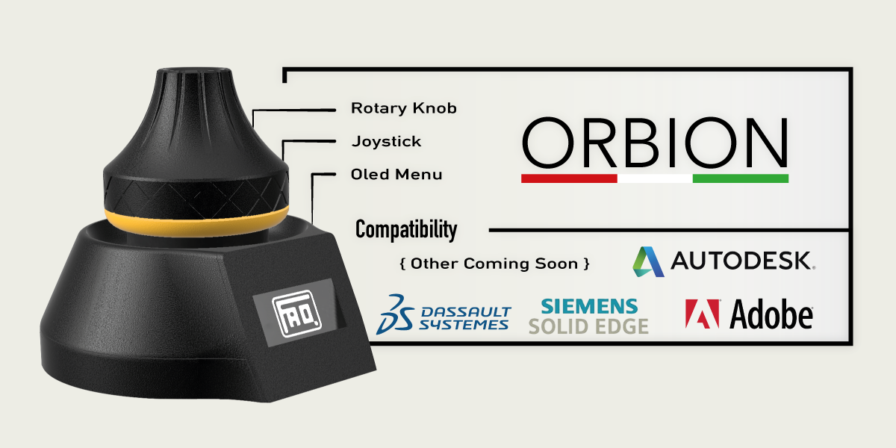

# Orbion The OpenSource Space Mouse

To ensure greater precision and fluidity it is recommended to put a foam ring under the knob (see photo above) and dielectric lubricant in the joystick!

Componets:

Oled 1.3" I2C: 
----- https://it.aliexpress.com/item/4001145494936.html?spm=a2g0o.productlist.0.0.20573c27WT2geb&aem_p4p_detail=202106241507354401350500623120002217940
Encoder (KY-040): 
----- https://it.aliexpress.com/item/32462116984.html?spm=a2g0o.productlist.0.0.571a4e49MqqpZF&algo_pvid=87ccb5ff-405d-470d-90ab-6a4e0d7f62ae&algo_exp_id=87ccb5ff-405d-470d-90ab-6a4e0d7f62ae-0
Joystick (KY-023): 
----- https://it.aliexpress.com/item/4000475154325.html?spm=a2g0o.productlist.0.0.374063deFR6hKg&algo_pvid=ddbba10f-997b-401b-94be-46e7dd41550f&algo_exp_id=ddbba10f-997b-401b-94be-46e7dd41550f-2
Arduino Pro Micro:
----- https://it.aliexpress.com/item/32768308647.html?spm=a2g0o.productlist.0.0.643527974MTuPS&algo_pvid=be64d3e2-77e6-4088-8183-d00e45084283&algo_exp_id=be64d3e2-77e6-4088-8183-d00e45084283-0
Push Button 8mm:
----- https://it.aliexpress.com/item/4000043687021.html?spm=a2g0o.productlist.0.0.26165826mnRCmC&algo_pvid=3beb2ee8-32bb-4f53-a586-e5abf7e4a821&algo_exp_id=3beb2ee8-32bb-4f53-a586-e5abf7e4a821-1
Foam
