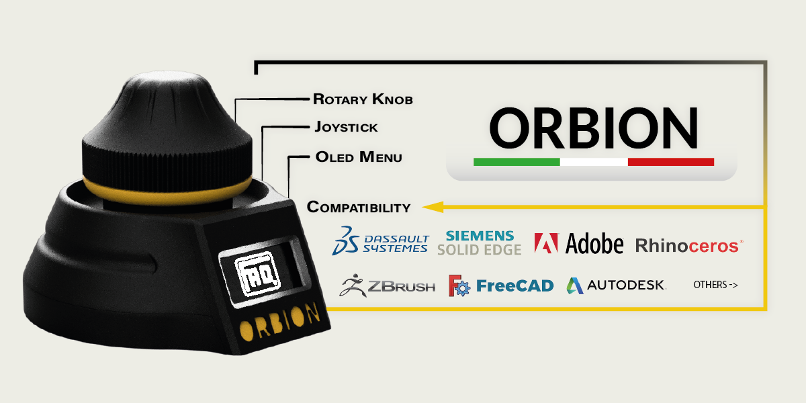
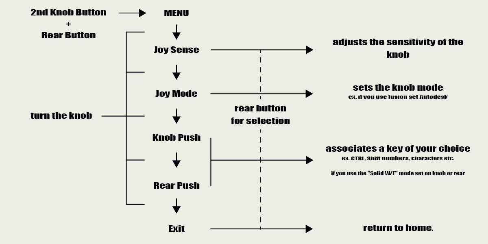
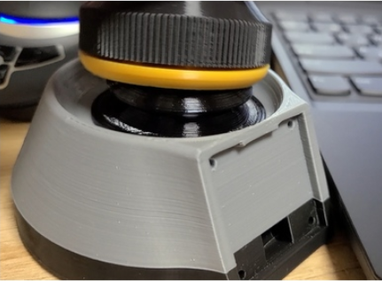

# Orbion The OpenSource Space Mouse

### Version now available
- Body 2.2 (09/02/2022)
- Firmware 0.26.2 (13/02/2022)

## Cushion to be created in TPU to replace the FOAM. Designed by HiNATA

# PAY ATTENTION

Please note that only Rev2 is taken into consideration

For problems caused by badly produced components and wrong heights due to the calibration of printers not created Tickets as they are unique problems and not attributable to the project.

To ensure greater precision and fluidity it is recommended to put a foam ring under the knob (see photo above) and dielectric lubricant in the joystick!

If you notice that your joystick goes in different directions, you can change the direction, swapping the cables VRx and VRy or alternatively the variables horzPin and vertPin in the sketch (Find the joystick section above)

Before printing pay attention to the center distance of the encoder holes, 2 more diffuse sizes are available, 14mm and 17mm (file Enc_holder & Knob_axis)

# Social

- [Instagram](https://www.instagram.com/faq_t0tum/)
- [Discord](https://discord.gg/3S2ZAGSf)
- [YouTube](https://www.youtube.com/channel/UCHJ_528ZI0BcSU-QA8kIJlg)
- [PusaPrinter](https://www.prusaprinters.org/social/218145-faqtotum/about)

# Buy me a coffee

The ORBION project is OpenSource so if you have the pleasure of supporting my next works I will be grateful fot the coffee.  
[PayPal](https://www.paypal.me/MattiaRusso308?locale.x=it_IT)

# Compatibility

Cad & 3D sculptors supported (continuously updated):
- Fusion360
- Autoocad
- SolidWork
- Solid EDGE
- Onshape
- Ansa
- ZBrush
- Blender
- Adobe Suite
- Rhino
- FreeCAD

# BOM

Componets:
- M3x15 (3pcs)
- M3x6 or M3x8 (2pcs)
- M3x10 (4pcs)
[M3 Kit](https://s.click.aliexpress.com/e/_9R4lDe)
- [Insert 5x4 or 5x5 (Diameter x Height) M3 (10pcs)](https://s.click.aliexpress.com/e/_9yVx2u)
- [Oled 1.3" I2C](https://s.click.aliexpress.com/e/_AtYDV6)
- [Encoder (KY-040)](https://s.click.aliexpress.com/e/_AmjV9a)
- [Joystick (KY-023)](https://s.click.aliexpress.com/e/_A8hY9K) (important: the joystick shaft must be 4mm)
- [Arduino Pro Micro](https://s.click.aliexpress.com/e/_AYt9zi) ATTENTION: It is essential to use ARDUINO PRO MICRO with ATMEL32U4 processor
- [Push Button 8mm](https://s.click.aliexpress.com/e/_ADGxZS)
- Foam

# License 
### [Attribution-NonCommercial-NoDerivatives 4.0 International](https://creativecommons.org/licenses/by-nc-nd/4.0/)
 

You are free to:
- Share — copy and redistribute the material in any medium or format

Under the following terms:
- Attribution — You must give appropriate credit, provide a link to the license, and indicate if changes were made. You may do so in any reasonable manner, but not in any way that suggests the licensor endorses you or your use.
- NonCommercial — You may not use the material for commercial purposes.
- NoDerivatives — If you remix, transform, or build upon the material, you may not distribute the modified material.

### If you have ideas, or changes made to the project and 'usually share them, you can contact me so publish them in the rapository (with your nick for thanks). 
### The choice of this license was chosen not to disperse the project, so as to improve its quality
