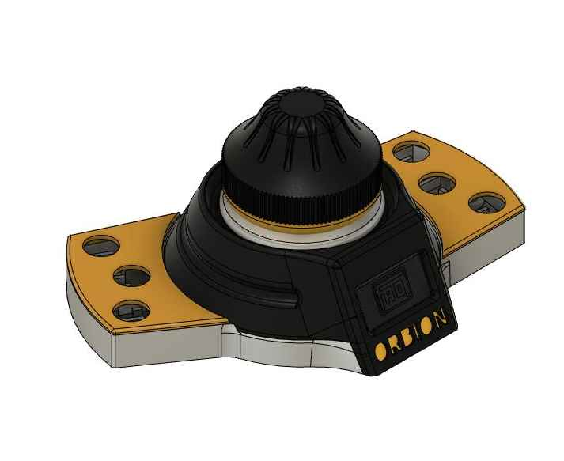
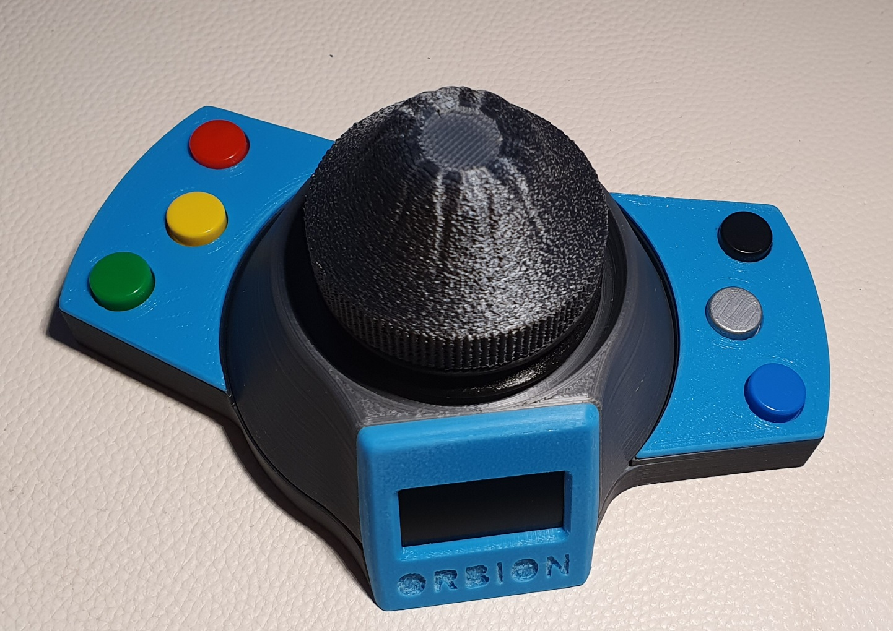

# Orbion MOD (Arcade) With 7 Push button By AFUDirk

# BOM

Componets:
- M3x15 (3pcs)
- M3x6 or M3x8 (2pcs)
- M3x10 (4pcs) 
[M3 Kit](https://s.click.aliexpress.com/e/_9R4lDe)
- [Insert 5x4 or 5x5 (Diameter x Height) M3 (10pcs)](https://s.click.aliexpress.com/e/_9yVx2u)
- [Oled 1.3" I2C](https://s.click.aliexpress.com/e/_AtYDV6)
- [Encoder (KY-040)](https://s.click.aliexpress.com/e/_AmjV9a)
- [Joystick (KY-023)](https://s.click.aliexpress.com/e/_A8hY9K) (important: the joystick shaft must be 4mm)
- [Arduino Pro Micro](https://s.click.aliexpress.com/e/_AYt9zi) ATTENTION: It is essential to use ARDUINO PRO MICRO with ATMEL32U4 processor
- [Rear push Button 8mm](https://s.click.aliexpress.com/e/_ADGxZS)
- [Push Button 8mm 6pcs](https://s.click.aliexpress.com/e/_A5RW7d)
- Foam
- Cushion (Printable in TPU)

I designed a macro keyboard that extends the ORBION_SPACE_MOUSE,
because the Arduino installed there still had many unused connections.
I have assigned the six keys with the following functions that are used frequently.
-L for line
-C for circle
-R for rectangle
-E for extrusion
-Q for push/pull
-Shift and 1 for four views preview

The buttons can be assigned as desired in the Arduino code.
The attached Arduino code refers to version 0.26.03.
The attached fusion file can be inserted into the existing project and connected to the base of the ORBION.
The two halves of the keyboard can be used if necessary depending on which version you use (MICO-USB or USB-C).
Please don't forget to add the two holes to the ORBION to attach the cables to perform.

### If you need a hand and clarification you will find the creator on 
[Discord](https://discord.gg/tgut7grRTV)